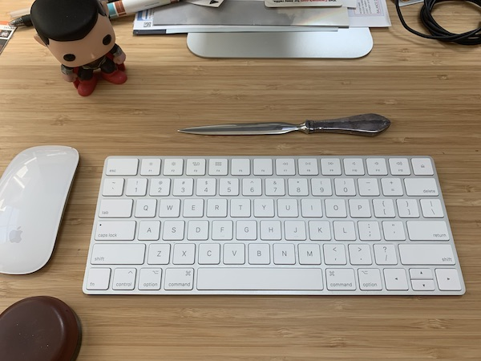
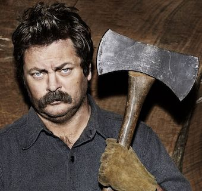
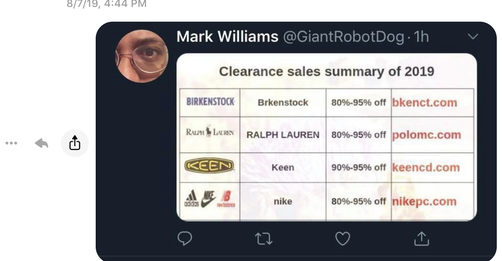

I think Mark and I first met at a Writers’ Club meeting, his high school freshman year, my sophomore. I was trying on different clubs and this group of folks, including Miranda, seemed like a good one.

I wasn’t really writing much and the club didn’t meet very often. I mean, we got the yearbook photo and the college application mention. What more did we need?

One of its members went on to write for The Daily Show and Conan, so someone must’ve gotten all the juice in that room.

Mark and I clicked due to music and movies and comics. I was between girlfriends. I had a car, which meant he could hitch to “Oxford, Too” for comics on Tuesdays after class. Dark Knight Returns and Watchmen were on their original publication runs, so we had plenty to nerd out about.

He showed me how to appreciate comic inking that looked “sloppy” yet was intentional. He yelled at me for watching _Aliens_ before _Alien_, then sat me down to make me watch it.

He knew about the deleted scenes and how they were referenced in _Aliens_ and now I understood.

Mark gave me my first real correction when I was being accidentally and casually racist.

I called his house and his dad answered. If you think Mark’s voice was deep and sonorous, his dad’s is twice over. I asked for Mark.

Mark came to the phone. I said something…stupid.

> Me: “Wow. Your dad’s voice is so deep, I thought for a second that I was talking to a 6’6” muscular bouncer named Luther.”

> Mark: “My dad’s name is Luther.”

> Me: “…Wait. Are you messing with me?”

Because you know he could. And would.

> Mark: “Nope. His name is Luther.”

> Me: “…”

Dead. Silence. That’s all it took. White-boy got schoooooled. And a needle that thought it was deeply green moved ever so slightly more away from the red.

Mark left Atlanta when his dad got an appointment to the NIH and moved to Maryland. We kept in touch, however lightly for the next couple of years.

I did visit him in Rockville the summer after my freshman year in college. A quick weekend trip. We watched “I’m Gonna Git U Sucka” and then hung out with some of his friends drinking beer, or was it Bartles & Jaymes?, on an abandoned railroad trestle bridge. I was so drunk that I kept dropping rocks, counting the time, insistent that I could do the physics equations in my head to figure out how high up we were.

There was too much drinking to be doing math.

On the way back to his house, we found ourselves near the top of the parking deck, peeing off the top into some bushes below.

I mean, he didn’t have to pee as far as the rest of us. But you know.

There was too much drinking to be acting responsibly.

I slept in big the next morning. And to this day, I think Mama Williams is still a bit mad that this white boy wasn’t very appreciative of whatever she cooked us for breakfast that morning.

I did a lot of stupid things that trip. How did I not fall off that bridge? How did we not get arrested? How did I not get a talking-to from Ms. W?

Recently, Mark checked with Mom and said she remembers me fondly. So, phew.

For either High School or College Graduation, Mark sent me a letter opener. A *letter opener*. Who does that? Who even was getting enough mail to justify it in the late 20th century. It’s got a Sterling Silver handle, with a little bit of texture and a stainless blade. It tarnishes a little, in an endearing way.

And now it’s going to stay on my desk, next to my computer, for-pretty-much-ever.

Fast forward a couple of decades.

Facebook has reunited many old friends. We had 25 years to catch up on, which like any good GenX’ers, we did on a mutiple-hour phone call. We talked about jobs, marriage, my kids. It was fun, we had several big chortles.

He told me about his marriage. And his thing for Megan Mullally types, especially if they wore Lisa-Loeb-style glasses. As long as they weren’t *vegan*, because that brought ex-wife flashbacks.

One happy side effect of Mark’s passing is that we don’t have to worry about Nick Offerman showing up with an axe.

Which is a good thing because I don’t stand a chance with nothing but a letter opener.

I was jealous that he had the first content to be considered Star Wars “new canon” post-Disney. He told me how to find the stories.

FYI, they are now easily found on the Star Wars website. Ping me and I’ll send you the links.

Any time I saw anything about B-wings I sent it to him and got a slow nod and and a “yes” from him.

I love the Blade Squadron patch - it will be my profile photo for a while. He was so psyched to share it with me. I nagged him to have a sticker or embroidered version of it made for years. And if it ever happens, it’ll have a place of honor on my backpack.

Mark texted that he was going to be starting a Facebook group of like-minded assholes, and since I enjoyed Haiku Wednesdays did I want in?

Sure. Why not? I’m never running for office.

While I never score high when taking these “depravity” tests, I do enjoy the banter and online friendships here. And the Haiku Wednesdays group. I’m a boring dad with plenty of dark snark. Which means I enjoy the pun games and dank memes. And the boobs.

The other night on Facebook we were taking Star Wars quotes and replacing one word with “coffee.” Yes, these threads are common and some folks think them boring. But this is my time to shine. I love them.

I once got stuck in a similar game where you had to make Disney-themed cocktails. I was declared the winner, inasmuch as one can, with “Lilo and Scotch.”

I crave your validation. And Mark’s.

My family and I were playing the Star Wars one out loud, and I was posting the really good ones. But Mark hadn’t liked any of them yet. So I kept at it for a bit longer, jonesing for dem Likes.

I was proudest of, “Watch your coffee kid or you’ll find yourself floating home.”

Still no Mark.

…

His Twitter account is gone - he didn’t use it, and hackers kept taking it to sell us all RayBans, Vans, Birkenstocks.

Mark - I keep telling you. People do NOT want to see my toes.

His Facebook window looks like it’s still open. Which is an off-putting artifact of the social media age. Our words have a half-life longer than in centuries past.

He won’t be randomly checking in via text. Or sending a surprise gift of a relic. Or, as I learned this weekend, Transformers Valentines with ribald messages.

But we’re posting his Haiku. His message threads. We are busy making him immortal.

Someone else we lost too soon - Robin Williams - had advice for these situations. And I think Mark would agree.

“When in doubt, go for the [dick joke][dick].”

_Davis W. Frank 2020 September 06_

[dick]: https://imgur.com/gallery/v4RZRwF
